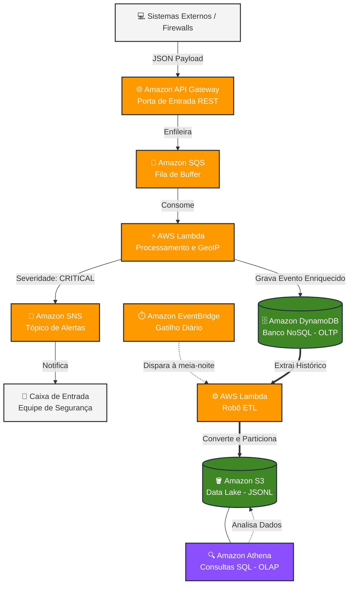

# 🛡️ EventShield: Serverless Security Data Pipeline

[](https://aws.amazon.com/)
[](https://www.python.org/)
[](https://www.terraform.io/)
[](https://github.com/features/actions)

O **EventShield** é um projeto pessoal de engenharia de dados de segurança, 100% *Serverless* na AWS, construído para estudar na prática como lidar com ingestão de logs de ameaças (como tentativas de injeção de SQL ou força bruta). A ideia foi simular um pipeline ponta a ponta: desde o desacoplamento da ingestão, passando por enriquecimento de geolocalização em tempo real, armazenamento transacional e alertas, até a estruturação de um Data Lake simples para consultas SQL.

Ainda é um projeto em evolução construído com foco em aprender arquiteturas serverless e boas práticas de IaC, não uma solução pronta para produção em larga escala.

---

## 🏗️ Arquitetura do Sistema

A arquitetura foi pensada para explorar conceitos de desacoplamento, resiliência a picos de tráfego e otimização de custos no modelo *pay-per-use*, sem depender de servidores dedicados.



---

## 🌟 Funcionalidades e Decisões de Engenharia

### 1. Ingestão e Resiliência (Desacoplamento)

* **Amazon API Gateway & Amazon SQS:** Alertas gerados por firewalls ou sistemas externos são enviados para uma rota HTTP. Em vez de processar diretamente (o que poderia sobrecarregar o sistema em um pico de eventos), a API apenas deposita a mensagem no SQS. A fila funciona como um amortecedor (*buffer*), reduzindo o risco de perda de dados durante picos de tráfego.

### 2. Processamento e Enriquecimento em Tempo Real

* **AWS Lambda (Python/Boto3):** Processa as mensagens da fila de forma assíncrona. A função extrai o IP de origem e busca dados de geolocalização, identificando **cidade, país e provedor de internet (ISP)** de quem originou o evento.
* **Amazon DynamoDB:** Armazena o registro final enriquecido. Por ser um banco NoSQL de chave-valor, permite escritas rápidas mesmo com o volume de dados crescendo.

### 3. Alertas Inteligentes de Negócio

* **Amazon SNS:** Quando a função de processamento identifica um evento com severidade `CRITICAL`, um gatilho dispara uma notificação por e-mail, incluindo os dados de geolocalização do evento para ajudar numa análise manual mais rápida.

### 4. Pipeline de ETL & Data Lake (Camada Analítica)

* **Amazon EventBridge & ETL Lambda:** Todos os dias, à meia-noite, um gatilho cron acorda a Lambda de ETL. Ela varre as novas linhas do DynamoDB, transforma a estrutura de dados NoSQL para o formato otimizado **JSON Lines (JSONL)** e salva no Amazon S3.
* **Particionamento Temporal:** Os dados são salvos no S3 organizados por partições físicas de data (`s3://bucket/dados-seguranca/ano=/mes=/dia=/`), o que reduz drasticamente o custo e o tempo de varredura de dados no futuro.

### 5. Serverless Analytics

* **Amazon Athena:** Mapeado em cima do S3 Data Lake, permite consultar os dados históricos e gerar relatórios agregados usando **SQL** padrão, sem precisar manter um banco de dados rodando o tempo todo.

---

## 🛠️ Tecnologias Utilizadas

* **Cloud Provider:** Amazon Web Services (AWS)
* **Linguagem:** Python 3.12 (SDK Boto3)
* **Infraestrutura como Código (IaC):** Terraform (Gerenciamento de estado remoto seguro no S3 + Lock via DynamoDB)
* **CI/CD:** GitHub Actions (Automação completa de testes e implantação)

---

## 🚀 Como Executar e Simular

### Pré-requisitos

* Terraform instalado
* AWS CLI configurado

### 1. Implantação da Infraestrutura

```bash
cd terraform/
terraform init
terraform apply -auto-approve
```

*Para obter a URL de execução gerada, use o comando:*

```bash
terraform output api_url
```

### 2. Simulação de Ingestão de Dados (Jornada do Dado)

Envie eventos de segurança simulados via terminal para validar o comportamento de ponta a ponta:

```bash
# Simulação 1: SQL Injection (Crítico - Dispara e-mail)
curl -X POST https://<SUA-API-URL>/dev/alerts \
-H "Content-Type: application/json" \
-d '{"event_id": "simulacao-001", "source_ip": "185.15.59.220", "event_type": "SQLInjection", "severity": "CRITICAL", "user_agent": "Sqlmap/1.6"}'

# Simulação 2: Força Bruta (Crítico - Dispara e-mail)
curl -X POST https://<SUA-API-URL>/dev/alerts \
-H "Content-Type: application/json" \
-d '{"event_id": "simulacao-002", "source_ip": "203.0.113.42", "event_type": "BruteForceAPI", "severity": "CRITICAL", "user_agent": "HackerTool/9.0"}'
```

### 3. Disparo Manual do Robô ETL

Para processar os dados e enviá-los ao Data Lake sem esperar a meia-noite, force a execução da Lambda:

```bash
aws lambda invoke --function-name eventshield_etl_processor resposta.json
```

### 4. Consulta de Inteligência no Amazon Athena

Execute a query abaixo no painel do Athena para consolidar as métricas de segurança geradas:

```sql
SELECT 
    event_type as Tipo_Ataque, 
    country as Pais_Origem, 
    COUNT(*) as Total_Detectado
FROM eventshield_analytics.historico_ataques 
GROUP BY event_type, country 
ORDER BY Total_Detectado DESC;
```

---

## 🗂️ Estrutura do Repositório

```
.
├── .github/workflows/       # Pipelines automatizados de CI/CD (GitHub Actions)
├── src/                     # Código-fonte das aplicações
│   ├── processor/           # Lambda de processamento e geolocalização (Python)
│   └── etl/                 # Lambda de extração e carga para o Data Lake (Python)
├── terraform/               # Arquivos de Infraestrutura como Código (IaC)
│   ├── main.tf              # Provedores e definições principais
│   ├── variables.tf         # Variáveis de ambiente da nuvem
│   └── outputs.tf           # Saídas do terminal (ex: URLs de conexão)
└── README.md                # Documentação do projeto
```

---

Projeto desenvolvido como estudo prático de Engenharia de Dados e arquitetura serverless na AWS.